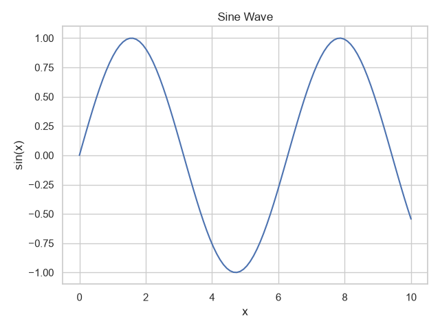
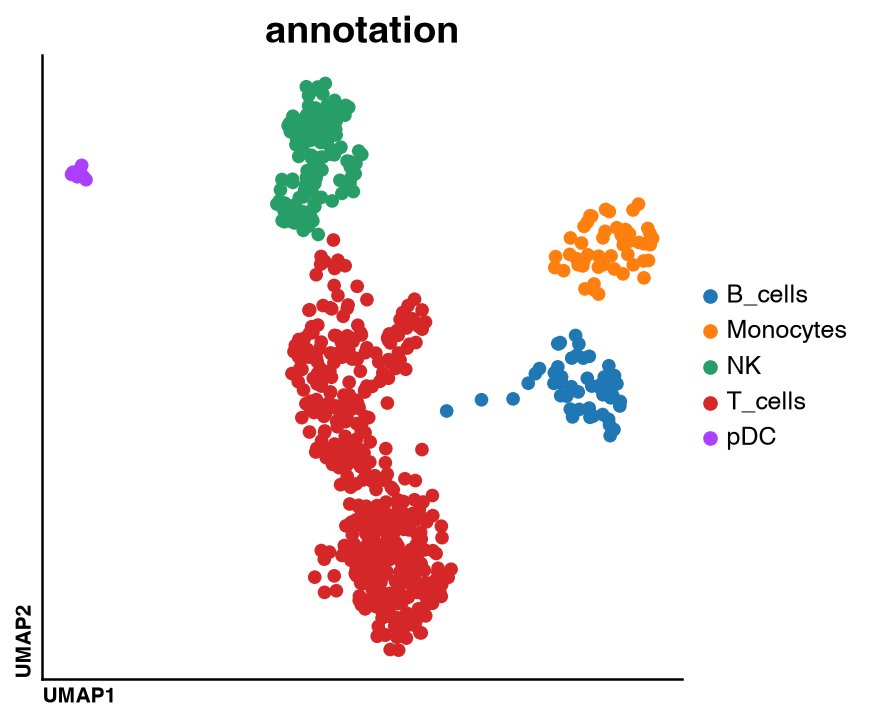

# Prelude_py

[![Tests][badge-tests]][tests]
[![Coverage][badge-coverage]][codecoverage]
[![Issues][badge-issues]][issue tracker]
[![Stars][badge-stars]](https://github.com/davidrm-bio/prelude_py/stargazers)
[![PyPI][badge-pypi]][pypi]
[](https://pepy.tech/projects/prelude-py)

[badge-tests]: https://img.shields.io/github/actions/workflow/status/davidrm-bio/prelude_py/test.yaml?branch=main
[badge-issues]: https://img.shields.io/github/issues/davidrm-bio/prelude_py
[badge-stars]: https://img.shields.io/github/stars/davidrm-bio/prelude_py?style=flat&logo=github&color=yellow
[badge-coverage]: https://codecov.io/gh/davidrm-bio/prelude_py/branch/main/graph/badge.svg
[badge-pypi]: https://img.shields.io/pypi/v/prelude_py.svg


`prelude_py` is a lightweight convenience module that provides lazy imports for commonly used scientific Python 
libraries through familiar aliases. Instead of importing each library individually, you can access them 
from a single namespace.

Modules are imported only when first accessed, so importing `prelude_py` itself has virtually no overhead.

## Installation

Install the package:

```bash
uv pip install prelude_py
```

To install all supported optional dependencies:

```bash
uv pip install "prelude_py[all]"
```

## Usage

```python
from prelude_py import np, pd, sns, plt

# NumPy
x = np.linspace(0, 10, 100)
y = np.sin(x)

# Pandas
df = pd.DataFrame({"x": x, "sin(x)": y})

# Seaborn
sns.set_theme(style="whitegrid")
sns.lineplot(data=df, x="x", y="sin(x)")
plt.title("Sine Wave")
plt.tight_layout()
plt.show()
```

Output:

<p align="center">
  
</p>


```python
from prelude_py import do

# Load example AnnData
adata = do.dt.example_10x_processed()

# Plot UMAP colored by cell annotation
do.pl.umap(adata, color="annotation")
```

Output:

<p align="center">
  
</p>


## Available aliases

| Alias  | Package             |
| ------ |---------------------|
| `np`   | `numpy`             |
| `nb`   | `numba`             |
| `pd`   | `pandas`            |
| `pl`   | `polars`            |
| `mpl`  | `matplotlib`        |
| `plt`  | `matplotlib.pyplot` |
| `sns`  | `seaborn`           |
| `do`   | `dotools_py`        |
| `ad`   | `anndata`           |
| `sc`   | `scanpy`            |
| `dc`   | `decoupler`         |
| `sq`   | `squidpy`           |
| `pt`   | `pertpy`            |
| `scvi` | `scvi-tools`            |

## License

This project is distributed under the MIT License.

[issue tracker]: https://github.com/davidrm-bio/prelude_py/issues
[tests]: https://github.com/davidrm-bio/prelude_py/actions/workflows/test.yaml
[pypi]: https://pypi.org/project/prelude_py/
[codecoverage]: https://codecov.io/gh/davidrm-bio/prelude_py
[down]: https://pepy.tech/project/dotools-py
